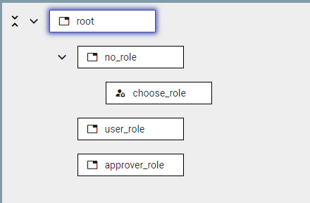
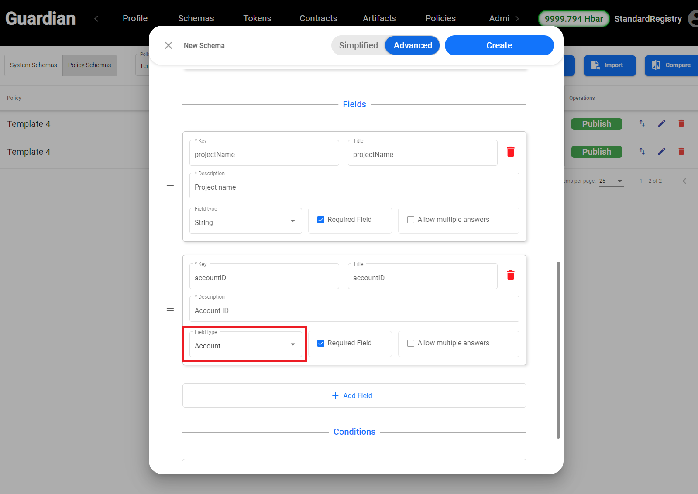
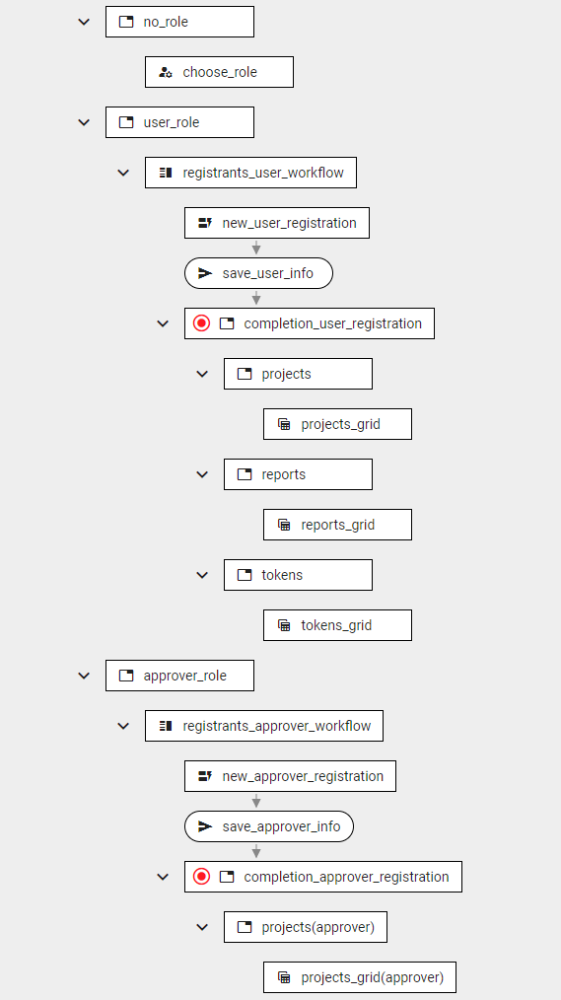
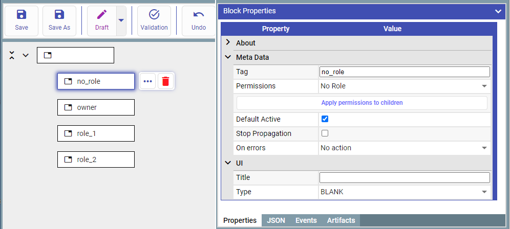
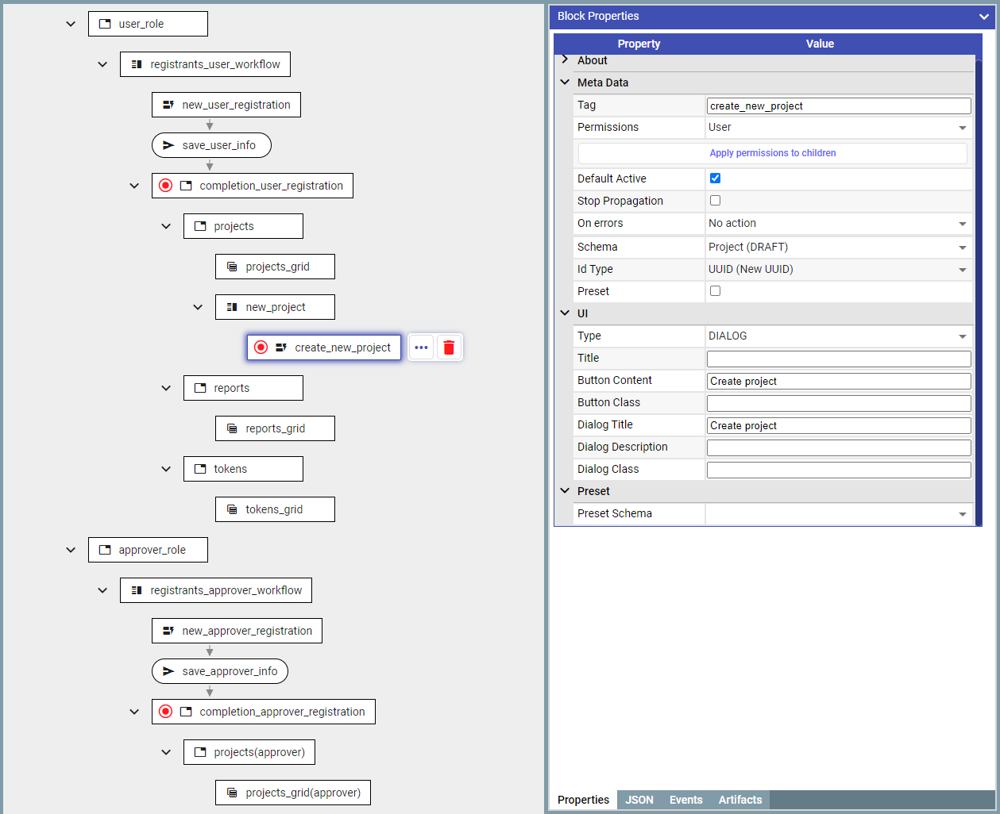
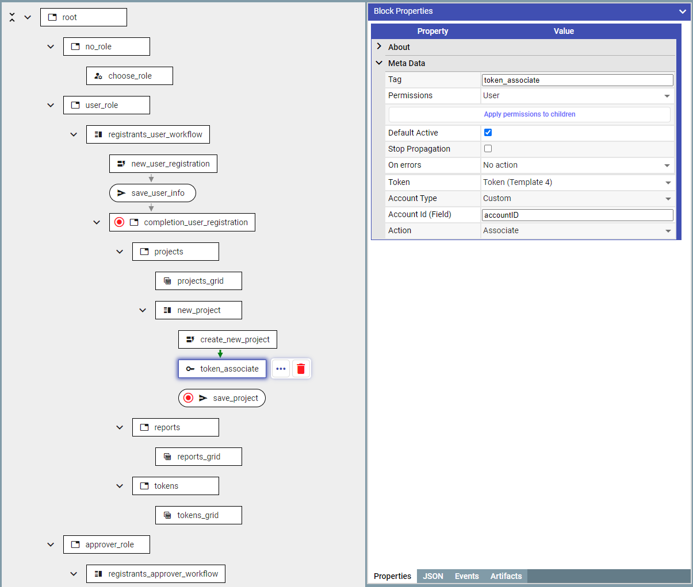
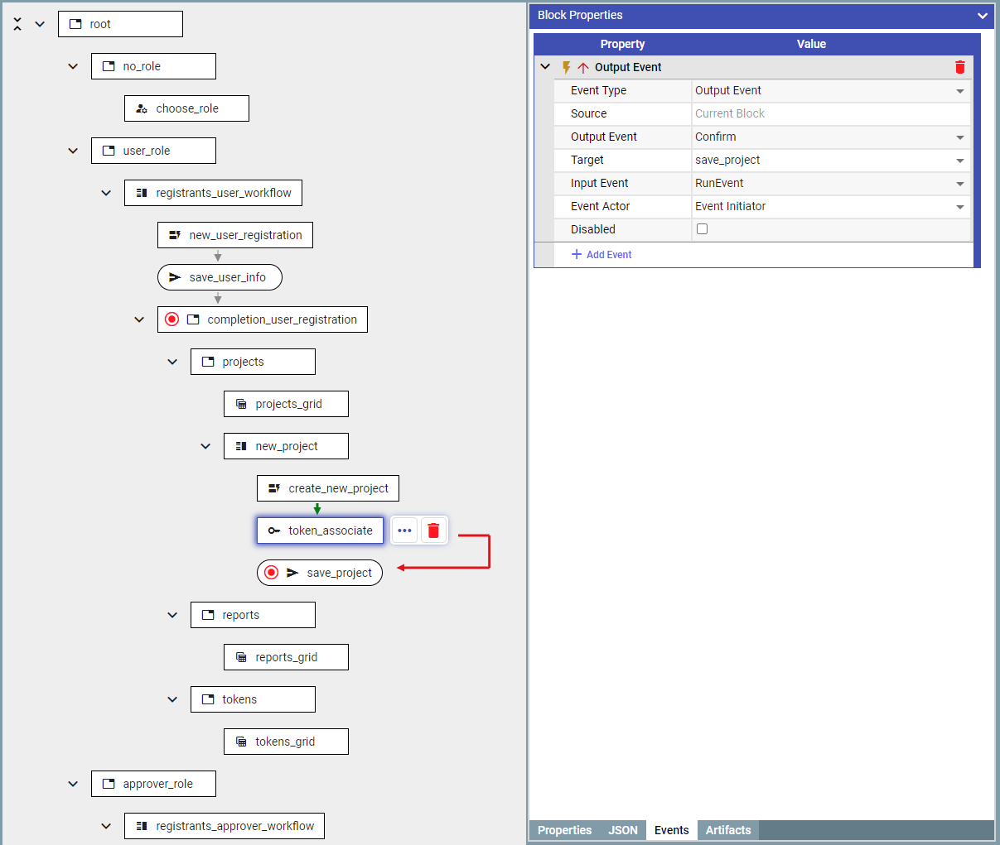

# Creating and using Roles

## **User roles usage in Policies**

### **An example of creating and using Roles in Policy**

1. Switch to the Roles tab

2. Create 2 new roles called ‘**Example role 1**_’ and_ ‘_**Example role 2**_’

3. In the root container create 4 more ’**interfaceContainerBlock**_’_ container called ‘**no\_role**_’_, ‘**owner**_’_, ‘**role\_1**_’ and ‘_**role\_2**_’_


**Note:** By default all containers would have ‘_Any Role’_ set and thus they would be visible to all users (with all roles)


4. Change the ‘Permissions’ properties in each container in the following way:

* no\_role: No Role
* owner: Owner
* role\_1: Example role 1
* role\_2: Example role 2

 

 

This would result in the following visibility of containers:

* The first container (called ’no role’) would be visible only to new users which have no role assigned to them
* The ‘owner’ container would be visible only to the Standard Registry which created (or imported) this policy
* The ‘role 1’ container would be visible only to users with ‘_Example role 1’_
* The ‘role 2’ container would be visible only to users with ‘_Example role 2’_

5. Add a ‘**policyRolesBlock**_’_ to the ‘_no\_role’_ container and name it ‘_choose\_role’_

Since this block is located inside the container ‘_no\_role_’ which has ‘_No role_’ permission setting it would only be visible to new users without an assigned role.

1. The ‘_Available Roles’_ property allows to configure which roles would be available to users to chose from at this stage of the Policy workflow

Select ‘_Example role 1’ and_ ‘E_xample role 2’_

1. Add ‘_informationBlock_’ to to other containers just to display results

**Results**:\

1. New users would end up on the policy choice form upon entering the policy

.png>)

1. After the selection of the role users would see only 1 container corresponding to their roles

.png>)

1. The owner of the Policy (the Standard Registry user) upon executing the policy would skip the role selection form and would immediately end-up in the corresponding container

.png>)
